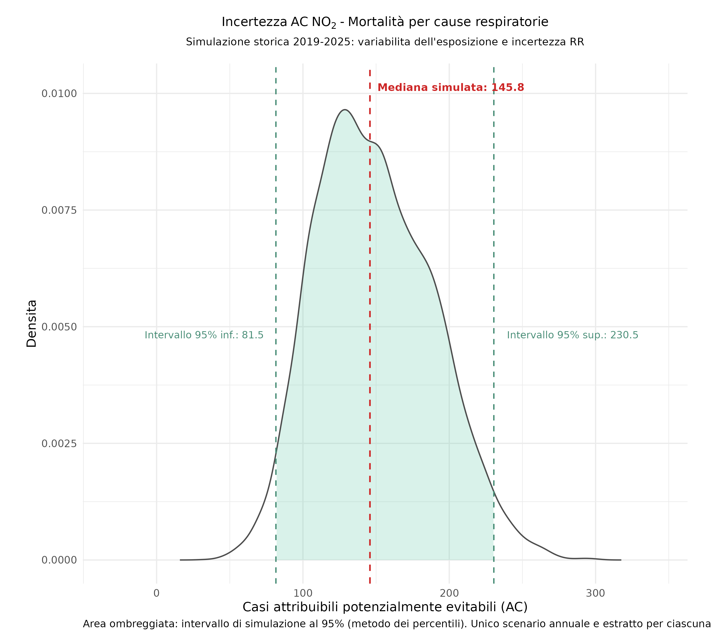

# Domanda di Sanità Pubblica

<br>
<br>

::: {.testo-centrato}

[**Quanti decessi per cause respiratorie sono potenzialmente evitabili se<br> l'esposizione annuale a $NO_2$ atmosferico viene ricondotta al livello guida OMS?**]{.highlight .big}

:::

<br>
<br>

*Valutazione controfattuale di impatto sanitario (VIS) del numero di casi attribuibili per esposizione a lungo termine (media annuale) ai livelli ambientali di $NO_2$ (outdoor) in Regione Veneto.*

<br>
<br>


- **Popolazione**: adulti residenti di età pari o superiore a 30 anni (adulti)

- **Territorio**: sezioni censuarie della Regione Veneto (ISTAT 2021)

- **Ambiente**: concentrazioni atmosferiche $NO_2$

- **Esito sanitario**: mortalità per malattie respiratorie (ICD-10 J00–J99)

- **Scenario controfattuale OMS**: valore guida $10\ \mu g\,m^{-3}$ (media annuale) 

- **Metodi**: funzione concentrazione-risposta (OMS AirQ+)

<br>


---

# Disegno di studio e fonti


:::: {.columns}

::: {.column width="50%"}

## Sezioni censuarie

<br>

```{r}
#| echo: false
#| fig-align: "center"
#| out-width: "100%"


knitr::include_graphics("./fig_tab/map_sezioni_censuarie_rv.png")

```

:::

::: {.column .left-align width="50%"}

<br>
<br>

::: {.tabella-grande style="--table-font-size: 24px; --table-line-height: 1.5; --table-padding: 8px;"}

| Componente | Dato utilizzato |
|:--|:--|
| Disegno | Studio ecologico su base territoriale |
| Unità demografica | 43 447 sezioni censuarie (ISTAT 2021) |
| Popolazione target | 3 521 995 residenti 30+ (ISTAT 2021) |
| Esposizione | $NO_2$ modello SPIAIR/CAMx griglia 4 km ARPAV |
| Mortalità basale | Tassi grezzi provinciali 30+ (ISTAT 2024) |
| Funzione rischio | $RR_{10}=1{.}05$ - IC 95%: 1.03 – 1.07 |
| Serie storica $NO_2$ | 2019–2025 ARPAV |
:::

:::

::::

<br>

- **Unità di analisi**: sezione censuaria come unità di popolazione con granularità spaziale più fine (normativa privacy dati sanitari individuali).

- **Granularità demografica**: la funzione concentrazione-risposta è applicata a ogni sezione prima dell'aggregazione regionale.

- **Mortalità basale**: impiego dei dei tassi grezzi provinciali è un'approssimazione esplicita (tassi età-specifici non disponibili).

---

# Dal controfattuale alla stima regionale

::: {.formula style="--formula-size: 36px;"}

[$\Delta C_i \longrightarrow AF_i \longrightarrow AC_i$]{.highlight}

:::


## Per sezione censuaria $i$:

$$
C_{i,\mathrm{cf}}=\min(C_{i,2025},10),
\qquad
\Delta C_i=\max(C_{i,2025}-10, 0)
$$

<br>

:::: {.columns}

::: {.column width="30%"}

## Decessi attesi

$$
E_i=N_{i,30+}\cdot B_{p(i),30+}
$$

$N_{i,30+}$: popolazione della sezione

$B_{p(i),30+}$: tasso grezzo provinciale

:::

::: {.column width="30%"}

## Frazione attribuibile

$$
AF_i = \frac{RR_i-1}{RR_i} = 1-e^{-\beta\Delta C_i}
$$
$$
RR_i = e^{\beta\Delta C_i} \qquad \beta=\frac{\log(RR_{10})}{10}
$$
$AF_i$: quota casi attribuibile all’esposizione

:::

::: {.column width="30%"}

## Casi attribuibili

$$
AC_i=E_i\cdot AF_i
$$
:::

::::

<br>

## Per Regione:

$$
AC_{\mathrm{Regione}}=\sum_i AC_i
$$

Nelle sezioni censuarie con $C_i \leq 10$ viene definito $\Delta C_i = 0$ per non attribuire un *artificiale effetto protettivo*.

---

# Sezioni | Popolazione | Attesi {.columns-max}

:::: {.columns}

::: {.column width="33%"}

<br>

## Sezioni censuarie

<br>

```{r}
#| echo: false
#| fig-align: "center"
#| out-width: "100%"


knitr::include_graphics("./fig_tab/map_sezioni_censuarie_rv.png")

```

- sezioni abitate: 43 447 
- superficie: 14 511 km2
- estensione mediana: 2.90 ha

:::

::: {.column width="33%"} 

<br>

## Popolazione residente 30+

<br>

```{r}
#| echo: false
#| fig-align: "center"
#| out-width: "100%"


knitr::include_graphics("./fig_tab/map_sez_pop30p.png")

```

- popolazione totale: 4 847 745 ab
- popolazione 30+ ($N$): 3 521 995 ab (73%)
- densità mediana: 13.5 ab/ha

:::


::: {.column width="33%"} 

<br>

## Casi attesi modellati

<br>

```{r}
#| echo: false
#| fig-align: "center"
#| out-width: "100%"


knitr::include_graphics("./fig_tab/map_sezioni_attesi.png")

```

- tasso grezzo mortalità provinciale ($B$)
- malattie sistema respiratorio (ICD-10:J00-J99)
- media tasso: 0.107% (0.084% - 0.140%)
- 107 casi ogni 100 000 ab

:::

::::

::: {.testo-centrato}

[**Mappatura demografico-attuariale della Regione Veneto**]{.highlight}

:::

---

# Qualità aria ambiente {.columns-max}

:::: {.columns}

::: {.column width="50%"}

## $NO_2$ modellistica 2019-2025


```{r}
#| echo: false
#| fig-align: "center"
#| out-width: "75%"


knitr::include_graphics("./fig_tab/map_no2_ts_rv.png")

```
:::

::: {.column width="50%"} 

## $NO_2$ boxplot per Provincia 2019-2025

```{r}
#| echo: false
#| fig-align: "center"
#| out-width: "75%"

knitr::include_graphics("./fig_tab/no2_boxplot_no2_provincia.png")

```

:::

::::

::: {.testo-centrato}

[Il valore OMS controfattuale non è una soglia biologica al di sotto della quale il rischio è necessariamente nullo.]{.highlight}

:::

---

# Concentrazioni ambientali per sezione {.columns-max}

:::: {.columns}


::: {.column width="50%"}

## $NO_2$ anno 2025

```{r}
#| echo: false
#| fig-align: "center"
#| out-width: "80%"

knitr::include_graphics("./fig_tab/map_sezioni_no2_2025.png")

```

- statistiche zonali $NO_2$ per sezione

:::

::: {.column width="50%"} 

## delta $NO_2$ : [2025] - [target OMS]


```{r}
#| echo: false
#| fig-align: "center"
#| out-width: "80%"

knitr::include_graphics("./fig_tab/map_sezioni_delta_no2_2025_target_oms.png")

```

- delta $NO_2$ per sezione

:::

::::

- Media annuale $NO_2$: overlay disegno sezioni censuarie e grigliato output modello dispersione atmosferica CAMx con risoluzione orizzontale 4 km. 

- Delta esposizione tra $NO_2$ al 2025 e controfattuale 10 $\mu g~m^{-3}$ (OMS): media 5.7 $\mu g~m^{-3}$, mediana  5.9 $\mu g~m^{-3}$, range interquartile 3.9 $\mu g~m^{-3}$.

::: {.testo-centrato}

[**Concentrazione ambientale vs. controfattuale OMS per sezione censuaria**]{.highlight}

:::

---

# Esposizione popolazione {.columns-max}

:::: {.columns}

::: {.column width="50%"} 

## Per Regione

```{r}
#| echo: false
#| fig-align: "center"
#| out-width: "65%"

knitr::include_graphics("./fig_tab/no2_exp_pop_2019_2025.png")

```

- media pesata popolazione: RV = 16 $\mu g~m^{-3}$

:::

::: {.column width="50%"} 

## Per Provincia

```{r}
#| echo: false
#| fig-align: "center"
#| out-width: "65%"

knitr::include_graphics("./fig_tab/no2_exp_pop_2019_2025_by_province.png")

```

-  media pesata popolazione: BL = 7 $\mu g~m^{-3}$, PD, VE = 18 $\mu g~m^{-3}$

:::

::::


---

# Stima puntuale 2025

:::: {.columns}

::: {.column width="50%"}

## Frazione Attribuibile per Sezione (AF)

<br>

```{r}
#| echo: false
#| fig-align: "center"
#| out-width: "100%"


knitr::include_graphics("./fig_tab/map_AF_sezioni_no2_2025.png")

```
:::

::: {.column width="50%"} 

## Attesi, AC, AF 
## stratificati per Provincia

<br>
<br>


| Provincia | Attesi | AC | AF | $AC_{low}$ | $AC_{upp}$ |
| :--- | ---: | ---: | ---: | ---: | ---: |
| Belluno | 209 | 0.21 | 0.0010 | 0.13 | 0.29 |
| Padova | 766 | 27.10 | 0.0354 | 16.50 | 37.30 |
| Rovigo | 148 | 2.84 | 0.0192 | 1.73 | 3.92 |
| Treviso | 587 | 17.40 | 0.0297 | 10.60 | 24.00 |
| Venezia | 626 | 23.90 | 0.0381 | 14.60 | 32.80 |
| Verona | 797 | 19.50 | 0.0245 | 11.90 | 26.90 |
| Vicenza | 668 | 17.70 | 0.0265 | 10.80 | 24.40 |

:::

::::

::: {.testo-centrato}

Per Regione Veneto, stima con valore centrale RR = 1.05:

[*$AC$ = 109 casi/anno per cause respiratorie nella popolazione età 30+ ($AF$ = 2.86%)*]{.highlight}

Per Regione Veneto, stima con incertezza RR (1.03 - 1.07):

[*$AC_{low}$ = 66.3 casi/anno ($AF_{low}$ = 1.74%), $AC_{upp}$ = 150.0 casi/anno  ($AF_{upp}$ = 3.95%)*]{.highlight}

:::

---

# Simulazione 2025

:::: {.columns}

::: {.column width="70%"}

```{r}
#| echo: false
#| fig-align: "center"
#| out-width: "85%"

knitr::include_graphics("./fig_tab/ac_sim_2025.png")
```

:::

::: {.column .left-align width="28.50%"}

<br>

## Che cosa varia?

- estrazione valore di $RR_{10}$ da una distribuzione log-normale.


## Rimangono fissi

- concentrazioni modellate 2025

- popolazione sezionale

- tassi grezzi provinciali


## Risultato

- **mediana:** 108,7 casi/anno

- **IC 95%:** 67,6–149,7 casi/anno

- **stima deterministica:** 109 casi/anno

<br>

[IC 95% propaga esclusivamente l'incertezza epidemiologica del $RR$ (condizionato agli altri input trattati come noti)]{.highlight}

:::

::::

---

# Simulazione storica 2019-2025

:::: {.columns}

::: {.column width="70%"}

```{r}
#| echo: false
#| fig-align: "center"
#| out-width: "85%"


```

:::

::: {.column .left-align width="28.50%"}

<br>

## A ogni iterazione

- selezionato un anno 2019 - 2025
- campo spaziale applicato a tutte le sezioni
- viene estratto un valore del $RR$
- popolazione e tassi basali fissi

## Risultato

- **mediana:** 145,8 casi/anno
- **intervallo 95%:** 81,5 – 230,5
- valore centrale superiore del **34%** rispetto al 2025

<br>

[Descrive la sensibilità agli scenari storici (anno di esposizione): non è un IC della stima 2025 e non è una previsione futura]{.highlight}

:::

::::

---

# Conclusioni


::: {.columns}

::: {.column .left-align width="33%"}

<br>

## Impatto sanitario

<br>

109 decessi respiratori attribuibili/anno

$$AF=2{,}86\%$$

popolazione 30+ nello scenario 2025

:::

::: {.column .left-align  width="33%"}

<br>

## Territorio

<br>

Il carico stimato è maggiore nelle aree con:

- popolazione più numerosa
- concentrazioni più elevate
- maggiore differenziale dal riferimento OMS

Padova e Venezia presentano i valori assoluti più elevati

:::

::: {.column .left-align width="33%"}

<br>

## Tempo

<br>

- Il 2025 è uno scenario relativamente favorevole rispetto a gran parte del periodo 2019–2025


- La simulazione storica non sostituisce la stima specifica del 2025.

:::

:::

<br>
<br>

::: {.row-highlight}

I risultati quantificano un impatto potenziale sulla popolazione 30+:

- *non* si tratta di decessi individualmente identificabili (stime ecologiche di gruppo)

- *non* è una dimostrazione di causalità locale (nesting $RR$ da letteratura OMS)

:::

---

# Limiti dello studio

<br>

::: {.columns}

::: {.column .left-align width="50%"}

## Dati e disegno

- natura ecologica dei dati;
- esposizione modellata con risoluzione di 4 km;
- analisi limitata al solo $NO_2$;
- popolazione, mortalità ed esposizione riferite ad anni diversi.

:::

::: {.column .left-align width="50%"}

## Mortalità e incertezza

- tassi grezzi provinciali applicati alle sezioni;
- mancato aggiustamento per la struttura per età;
- incertezza di popolazione, tassi ed esposizione non propagata;
- serie storica di soli sette anni e caratterizzata da un trend.

:::

:::

::: {.row-highlight}

IC della simulazione 2025 rappresenta l'incertezza del $RR$, non l'incertezza complessiva della VIS.

:::

---

# Possibili sviluppi futuri

<br>
<br>

- **Mortalità basale età-specifica**

   Applicare, quando disponibili, i tassi provinciali età-specifici.

- **Propagazione integrata dell'incertezza**  

   Includere errore delle concentrazioni modellate, tassi basali e stime demografiche.

- **Modellazione spazio-temporale**  

   Rappresentare dipendenza tra aree contigue, autocorrelazione e trend delle concentrazioni.

- **Analisi causale e socio-demografica**  

   Integrare covariate territoriali e metodi di inferenza causale spaziale.

<br>
<br>

::: {.row-highlight}

Priorità

acquisire tassi età-specifici e verificare quanto la scelta del tasso basale influenzi i risultati finali (analisi di sensitività).

:::

---

# Fine {.section-slide data-visibility="uncounted"}

---

# BACKUP SLIDES

