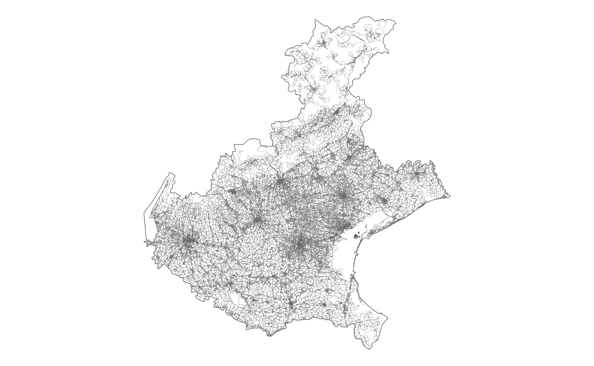
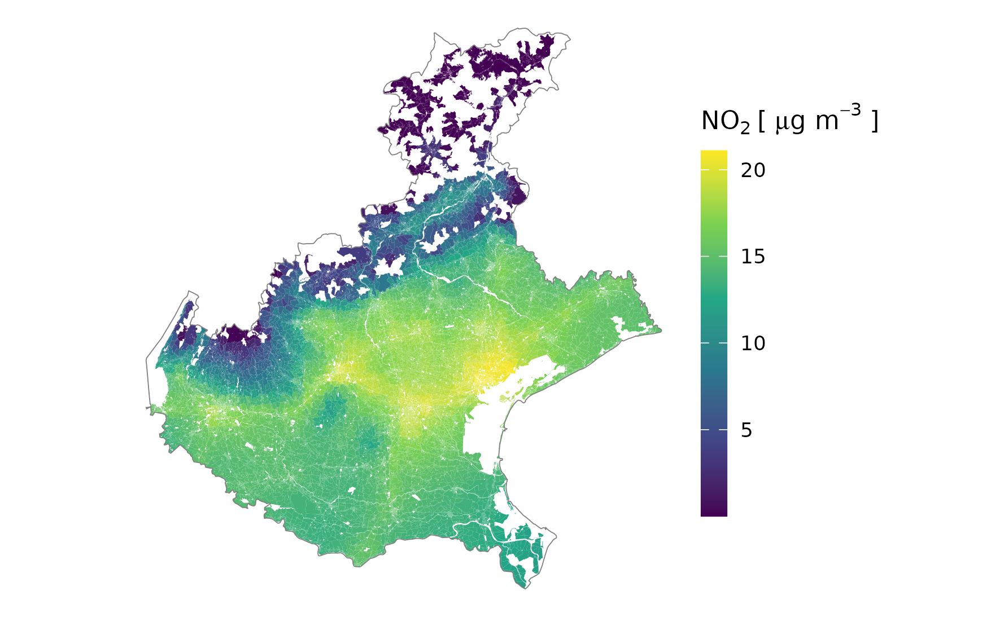
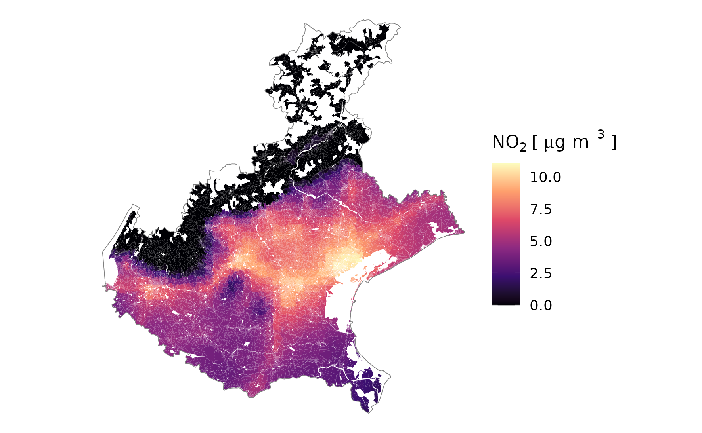
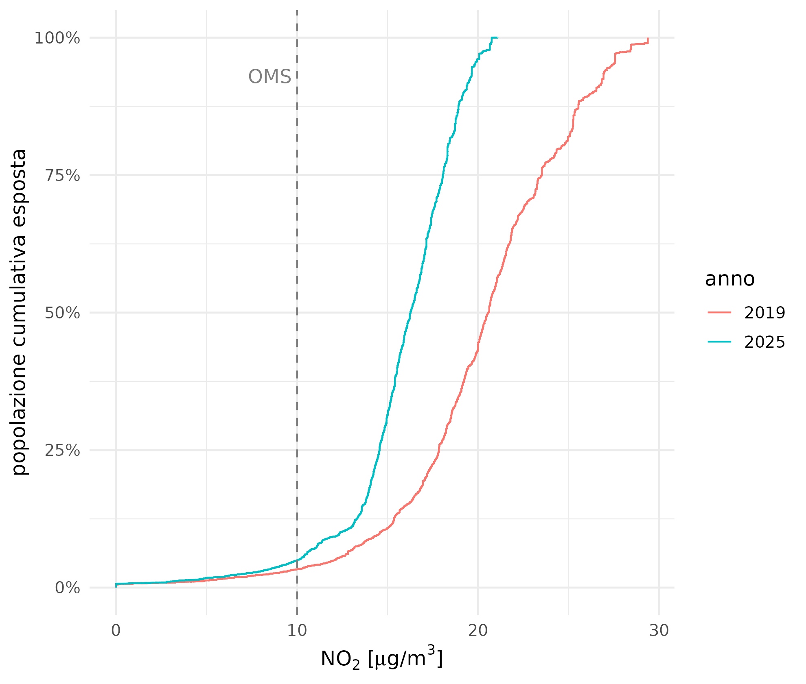
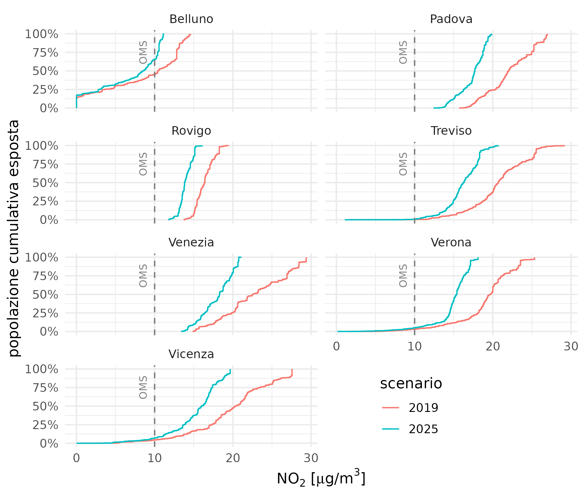
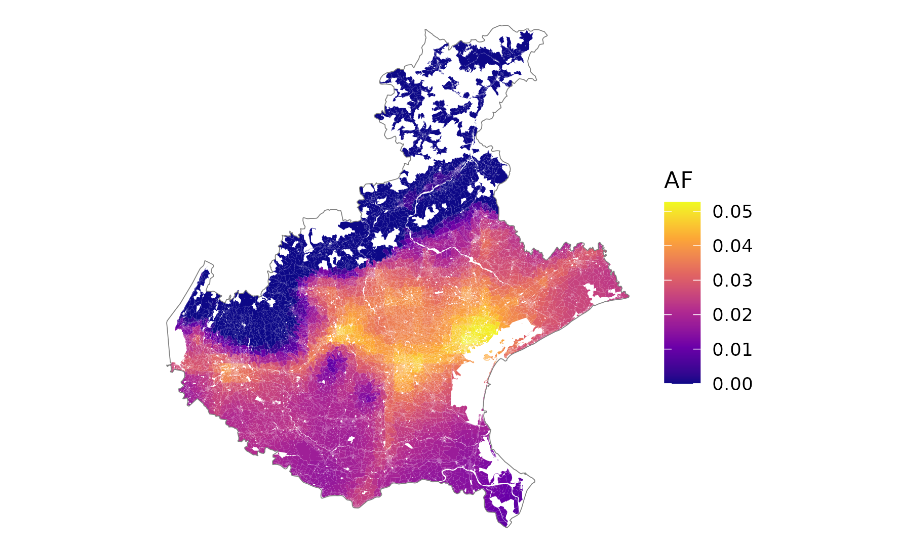
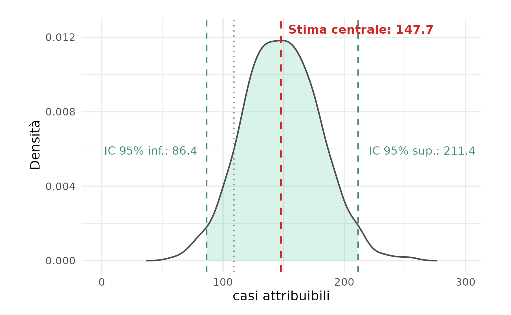

# Project Work Overview

## Obiettivo

- valutazione controfattuale di impatto sanitario (VIS) del numero di
casi attribuibili (casi di mortalità per cause respiratorie) associati all’esposizione a lungo termine (media annuale) dei livelli ambientali (outdoor) dellw concentrazioni atmosferiche di $NO_2$

## Metodi

- unità di analisi: sezione censuarie in Regione Veneto (ISTAT 2021)

- concentrazioni $NO_2$ da modellistica di dispersione atmosferica in Regione Veneto (serie storica 2019-2025)

- soglia controfattuale di esposizione (no effetti significativi riconosciuti) da letteratura OMS 10 $\mu g~m^{-3}$ 

- tassi grezzi mortalità di base per cause respiratorie (Codici ICD-10: J00-J99) per Provincia (casi attesi)

- Risk Ratio (OMS/HRAPIE-2, 2025): 1.05 (1.03 - 1.07) per popolazione 30+ in sezioni censuarie 

- funzione concentrazione risposta (formula OMS AirQ+) per stima causale determinante ambientale ed esito sanitario


## Risultati

- stima puntuale casi attribuibili (AC) e frazione attribuibile (AF) anno 2025 per Regione Veneto (somma totale casi stimati per sezione)

- bootstrap non parametrico per propagazione statistica incertezza di stima AC e AF

---


# Formula OMS VIS

**Casi attribuibili ($AC$): quota di casi attesi associati all'inquinamento atmosferico da $NO_2$**

<br>


::: {.formula .highlight style="--formula-size: 36px;"}

[$$AC = N \cdot B \cdot AF$$]{.highlight}

:::


- $N$: popolazione target di riferimento (popolazione $30+$)

- $B$: tasso basale grezzo esito sanitario (mortalità per cause respiratorie)

<br>

**Frazione attribuibile ($AF$): rapporto casi attribuibili su casi attesi (casi attesi = $N \cdot B$)**

<br>

::: {.formula .highlight}

$$AF = \frac{RR - 1}{RR} = 1 - \frac{1}{e^{\beta \cdot \Delta C}} = 1 - e^{-\beta \cdot \Delta C}$$
:::


-  $\frac{RR - 1}{RR}$ proporzione dei casi sanitari evitati se l'esposizione viene ridotta sotto la soglia controfattuale

- $e^{\beta \cdot \Delta C}$ *$Rischio Relativo* per il differenziale di concentrazione $\Delta C$

- $\beta = \frac{\ln(RR_{10})}{10}$ coefficiente funzione log-lineare concentrazione-risposta scalato su $10 \ \mu g~m^{-3}$


---

# Sezioni | popolazione | attesi {.columns-max}

:::: {.columns}

::: {.column width="33%"}

<br>

## Sezioni censuarie ISTAT 2021

<br>

```{r}
#| echo: false
#| fig-align: "center"
#| out-width: "100%"




```

- 43 447 sezioni abitate 
- superficie 14 511 km2
- estensione  mediana 2.90 ha

:::

::: {.column width="33%"} 

<br>

## Popolazione classe d'età 30+

<br>

```{r}
#| echo: false
#| fig-align: "center"
#| out-width: "100%"


knitr::include_graphics("./fig_tab/map_sez_pop30p.png")

```

- popolazione totale: 4 847 745 abitanti
- popolazione 30+: 3 521 995 abitanti (73%)
- densità mediana: 13.5 ab/ha

:::


::: {.column width="33%"} 

<br>

## Casi attesi per sezione

<br>

```{r}
#| echo: false
#| fig-align: "center"
#| out-width: "100%"


knitr::include_graphics("./fig_tab/map_sezioni_attesi.png")

```

- malattie sistema respiratorio (ICD-10:J00-J99)
- tasso grezzo mortalità provinciale ($B$)
- mortalità media RV: 0.107% (0.084% - 0.140%)
- 107 casi ogni 100 000 abitanti

:::

::::

<br>

::: {.testo-centrato}

[**Mappatura demografico-attuariale della Regione Veneto**]{.highlight}

:::

---

# Quadro ambientale {.columns-max}

:::: {.columns}

::: {.column width="50%"}

## NO2 output modellistica 2019-2025

<br>

```{r}
#| echo: false
#| fig-align: "center"
#| out-width: "100%"


knitr::include_graphics("./fig_tab/map_no2_ts_rv.png")

```
:::

::: {.column width="50%"} 

## NO2 boxplot 2019-2025

<br>

```{r}
#| echo: false
#| fig-align: "center"
#| out-width: "100%"

knitr::include_graphics("./fig_tab/no2_boxplot_no2_provincia.png")

```
:::

::::

---

# Concentrazioni ambientali per sezione {.columns-max}

:::: {.columns}


::: {.column width="33%"}

## Sezioni censuarie ISTAT 2021

<br>

```{r}
#| echo: false
#| fig-align: "center"
#| out-width: "100%"


```

- map overlay disegno sezioni

:::


::: {.column width="33%"}

## $NO_2$ anno 2025

<br>

```{r}
#| echo: false
#| fig-align: "center"
#| out-width: "100%"



```

- statistiche zonali $NO_2$ per sezione

:::

::: {.column width="33%"} 

## delta $NO_2$ : [2025 - target OMS]

<br>

```{r}
#| echo: false
#| fig-align: "center"
#| out-width: "100%"



```

- delta $NO_2$ per sezione

:::

::::

qui testo descrittivo

---

# Esposizione popolazione {.columns-max}

:::: {.columns}

::: {.column width="50%"} 

## Per Regione

```{r}
#| echo: false
#| fig-align: "center"
#| out-width: "100%"



```

:::

::: {.column width="50%"} 

## Per Provincia

```{r}
#| echo: false
#| fig-align: "center"
#| out-width: "100%"



```

:::

::::

::: {.testo-centrato}

[**Confronto con valore controfattuale OMS**]{.highlight}

:::

---

# Stima puntuale 2025 {.columns-max}

:::: {.columns}

::: {.column width="50%"}

## Frazione attribuibile per sezione (AF)

<br>

```{r}
#| echo: false
#| fig-align: "center"
#| out-width: "100%"




```
:::

::: {.column width="50%"} 

## Attesi, AC, AF 
## stratificati per provincia

<br>
<br>


| Provincia | Attesi | AC | AF | $AC_{low}$ | $AC_{upp}$ |
| :--- | ---: | ---: | ---: | ---: | ---: |
| Belluno | 209 | 0.21 | 0.0010 | 0.13 | 0.29 |
| Padova | 766 | 27.10 | 0.0354 | 16.50 | 37.30 |
| Rovigo | 148 | 2.84 | 0.0192 | 1.73 | 3.92 |
| Treviso | 587 | 17.40 | 0.0297 | 10.60 | 24.00 |
| Venezia | 626 | 23.90 | 0.0381 | 14.60 | 32.80 |
| Verona | 797 | 19.50 | 0.0245 | 11.90 | 26.90 |
| Vicenza | 668 | 17.70 | 0.0265 | 10.80 | 24.40 |

:::

::::

::: {.compatto .testo-centrato}

Per Regione Veneto, con valore centrale RR = 1.05:

[*$AC$ = 109 casi/anno per cause respiratorie nella popolazione età 30+ ($AF$ = 2.86%)*]{.highlight}

Per Regione Veneto, con incertezza RR (1.03 - 1.07):

[*$AC_{low}$ = 66.3 casi/anno ($AF_{low}$ = 1.74%), $AC_{upp}$ = 150.0 casi/anno  ($AF_{upp}$ = 3.95%)*]{.highlight}

:::

# Stima bootstrap casi attribuibili

```{r}
#| echo: false
#| fig-align: "center"
#| out-width: "80%"



```

---

# Conclusioni


---

# Limiti e sviluppi futuri


---

# new

## Titolo h2 nel corpo della slide

normal text

This is a sentence where I want to change a [specific]{.highlight} word.

This is a sentence where one [word]{.big} is scaled up.

::: {.row-highlight}
This entire row of text will have a background highlight stretching across the slide.
:::

---

# Titolo slide 2 — Risultati e conclusioni

## Titolo h2 nel corpo della slide

BULLET

- bullet
- bullet 

NUMBER

1. numbered
1. numbered

### Titolo h3 nel corpo della slide

Testo conclusivo.

---

# Fine {.section-slide data-visibility="uncounted"}

---

# BACKUP SLIDES