# Domanda VIS \| disegno \| fonti

<br>

::: testo-centrato
[**Quanti decessi per cause respiratorie sono potenzialmente evitabili
se**<br> l'esposizione annuale a $NO_2$ atmosferico viene ricondotta al
livello guida OMS?]{.highlight .big}
:::

<br>

:::::: columns
::: {.column width="50%"}

```{r}
#| echo: false
#| fig-align: "center"
#| out-width: "120%"


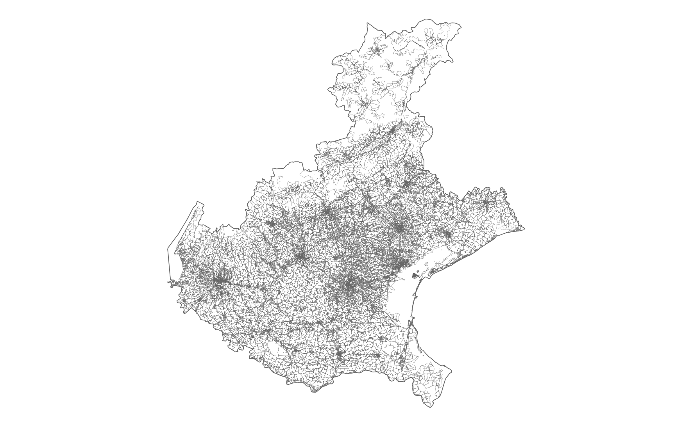

```
:::

:::: {.column .left-align width="50%"}

<br>

::: {.tabella-grande style="--table-font-size: 22px; --table-line-height: 1.5; --table-padding: 2px; --table-width: 100%; --col1-width: 20%; --col2-width: 80%;"}

| Componente           | Specifiche / Dato utilizzato                     |
|:---------------------|:-------------------------------------------------|
| Disegno              | Studio ecologico su base territoriale                   |
| Unità analisi        | 43 447 sezioni censimento (ISTAT 2021)            |
| Popolazione          | 3 521 995 residenti, target 30+ (ISTAT 2021)             |
| Determinante         | $NO_2$ modello 4 km, serie 2019–2025 (ARPAV)            |
| Esposizione          | Lungo termine (media annuale), no effetti acuti (OMS)
| Mortalità basale     | Tassi grezzi provinciali 30+ (ISTAT 2024)        |
| Esito sanitario      | Mortalità per malattie respiratorie (ICD-10 J00–J99) |
| Rischio relativo     | $RR_{10}=1{.}05$ (1.03 – 1.07) (OMS)     |
| Controfattuale       | $NO_2 \leq 10\ \mu g\,m^{-3}$ (OMS Linee Guida AQ)                               |
:::
::::
::::::

::: testo-centrato
[Sezione di censimento ISTAT come unità spaziale e demografica con più fine granularità:<br>estensione mediana 2.90 ha, densità popolazione mediana 13.5 ab/ha]{.highlight}
:::

---

# Dall'esposizione ai casi attribuibili

<br>

```{dot}
//| fig-width: 14
//| fig-height: 7.2

digraph VIS {

  graph [
    rankdir=TB,
    bgcolor="transparent",
    pad=0.05,
    nodesep=0.38,
    ranksep=0.38,
    splines=ortho
  ];

  node [
    shape=box,
    style="rounded,filled",
    fontname="Arial",
    fontsize=16,
    fixedsize=true,
    margin="0.08,0.05",
    penwidth=2
  ];

  edge [
    color="#7D7D7D",
    penwidth=2,
    arrowsize=0.7
  ];

  A [
    label="NO₂ per sezione",
    width=2.20,
    height=0.70,
    fillcolor="#FFFFFF",
    color="#7D7D7D",
    fontcolor="#393D3F"
  ];

  B [
    label="Popolazione 30+",
    width=2.20,
    height=0.70,
    fillcolor="#FFFFFF",
    color="#7D7D7D",
    fontcolor="#393D3F"
  ];

  C [
    label="Mortalità basale",
    width=2.20,
    height=0.70,
    fillcolor="#FFFFFF",
    color="#7D7D7D",
    fontcolor="#393D3F"
  ];

  D [
    label="RR₁₀ OMS: 1,05",
    width=2.20,
    height=0.70,
    fillcolor="#FFFFFF",
    color="#7D7D7D",
    fontcolor="#393D3F"
  ];

  E [
    label="Eccedenza esposizione\nΔC = max(C − 10, 0)",
    width=3.20,
    height=0.78,
    fillcolor="#FFFFFF",
    color="#AA0004",
    fontcolor="#393D3F"
  ];

  F [
    label="Casi attesi\nE = N × B",
    width=3.20,
    height=0.78,
    fillcolor="#FFFFFF",
    color="#AA0004",
    fontcolor="#393D3F"
  ];

  G [
    label="Frazione attribuibile\nAF = 1 − exp(−βΔC)",
    width=3.20,
    height=0.78,
    fillcolor="#FFFFFF",
    color="#AA0004",
    fontcolor="#393D3F"
  ];

  H [
    label="Casi attribuibili per sezione\nAC = E × AF",
    width=3.40,
    height=0.78,
    fillcolor="#FFFFFF",
    color="#AA0004",
    fontcolor="#393D3F"
  ];

  I [
    label="Aggregazione",
    width=3.40,
    height=0.78,
    fillcolor="#FFFFFF",
    color="#AA0004",
    fontcolor="#393D3F"
  ];

  J [
    label="Stima puntuale 2025",
    width=3.25,
    height=0.82,
    fontsize=18,
    fillcolor="#AA0004",
    color="#850205",
    fontcolor="#FFFFFF"
  ];

  K [
  label="Simulazione 2025\n(incertezza del RR)",
  width=3.25,
  height=0.82,
  fontsize=18,
  fillcolor="#AA0004",
  color="#850205",
  fontcolor="#FFFFFF"
];

L [
  label="Simulazione storica\n2019–2025",
  width=3.25,
  height=0.82,
  fontsize=18,
  fillcolor="#AA0004",
  color="#850205",
  fontcolor="#FFFFFF"
];

M [
    label="Ripetizione Monte Carlo\ndel calcolo e aggregazione",
    width=3.25,
    height=0.82,
    fillcolor="#FFFFFF",
    color="#AA0004",
    fontcolor="#393D3F"
  ];

  { rank=same; A; B; C; D; }
  { rank=same; E; F;}
  { rank=same; I; M; }
  { rank=same; J; K; L;}

  A -> E;
  B -> F;
  C -> F;
  D -> G;
  E -> G;
  F -> H;
  G -> H;
  H -> I;
  H -> M;
  I -> J;
  M -> L;
  M -> K;
  
/* trick: impone l’ordine orizzontale */
J -> K [style=invis, weight=100];
K -> L [style=invis, weight=100];
}


```


---

# Mappatura concentrazioni ambientali {.columns-max}

::::: columns
::: {.column width="50%"}

## $NO_2$ modellistica 2019-2025


```{r}
#| echo: false
#| fig-align: "center"
#| out-width: "75%"


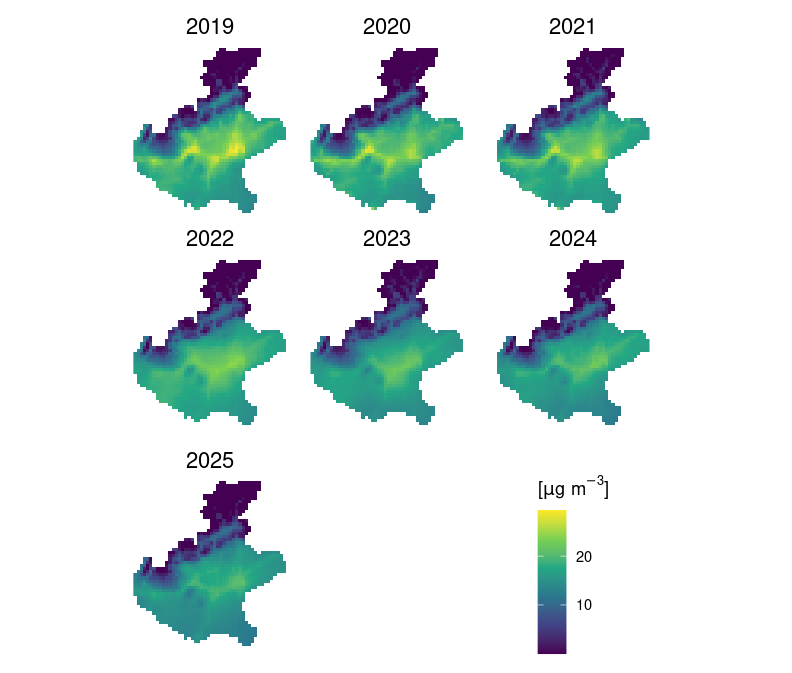

```
:::

::: {.column width="50%"}

## $NO_2$ boxplot per Provincia 2019-2025


```{r}
#| echo: false
#| fig-align: "center"
#| out-width: "75%"

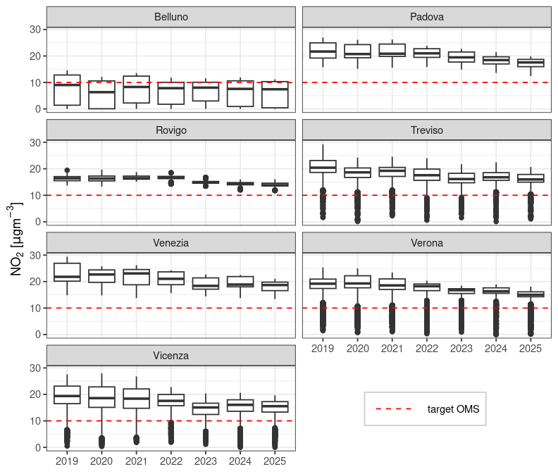

```
:::
:::::

::: testo-centrato
[Il controfattuale OMS  non è una soglia biologica al di sotto
della quale il rischio è necessariamente nullo.<br>Rappresenta un 'valore guida' definito sulla base della attuali conoscenze scientifiche.]{.highlight}
:::

---


# Esposizione cumulativa popolazione {.columns-max}

::::: columns
::: {.column width="50%"}

## Per Regione

```{r}
#| echo: false
#| fig-align: "center"
#| out-width: "65%"

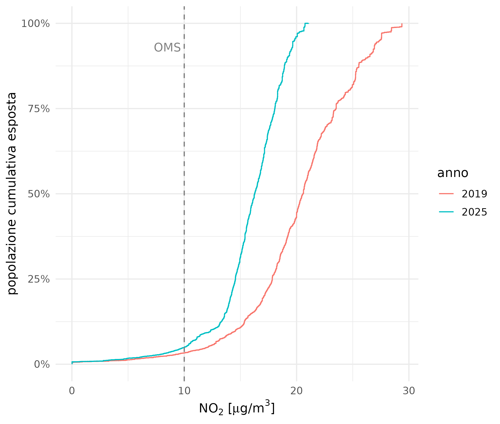

```

2025, media pesata: 16 $\mu g~m^{-3}$

:::

::: {.column width="50%"}

## Per Provincia

```{r}
#| echo: false
#| fig-align: "center"
#| out-width: "65%"

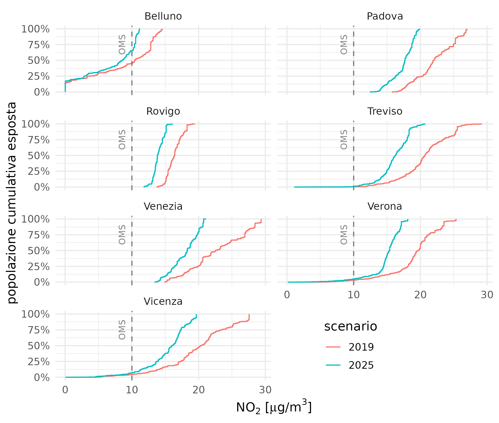

```

2025, media pesata: BL = 7 $\mu g~m^{-3}$, PD e VE = 18
  $\mu g~m^{-3}$
:::
:::::

---

# Concentrazioni ambientali per sezione {.columns-max}

::::: columns
::: {.column width="50%"}
## $NO_2$ anno 2025

```{r}
#| echo: false
#| fig-align: "center"
#| out-width: "80%"

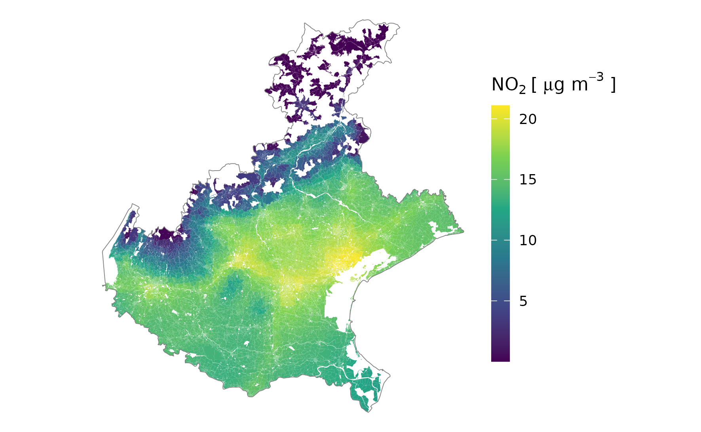

```

media pesata  $NO_2$ sulla superficie
:::

::: {.column width="50%"}
## Differenziale $NO_2$ : \[2025\] - \[target OMS\]

```{r}
#| echo: false
#| fig-align: "center"
#| out-width: "80%"

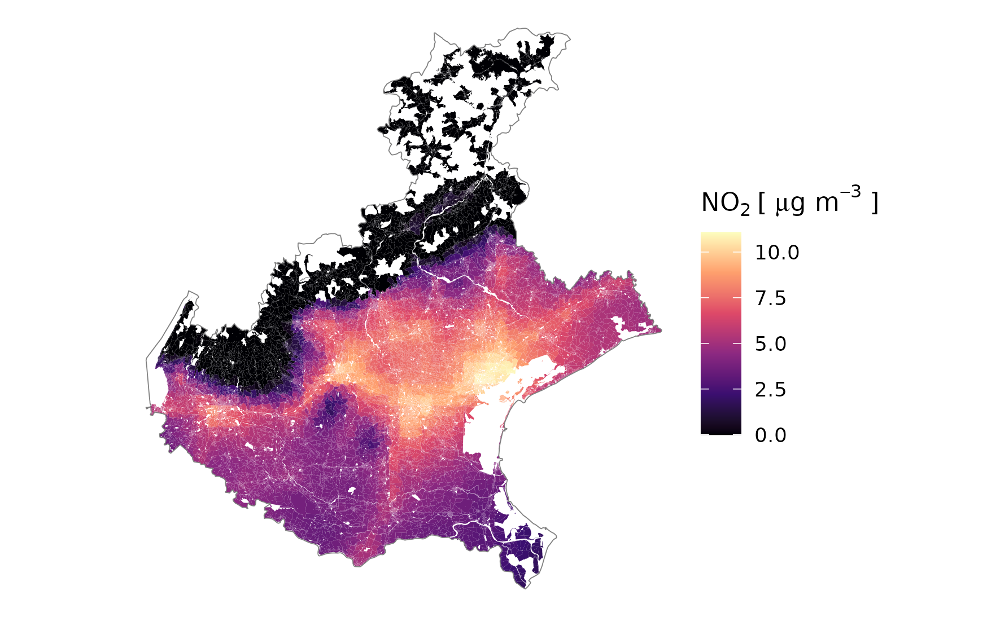

```

delta controfattuale $NO_2$

:::
:::::

Media annuale $NO_2$: overlay disegno sezioni censuarie e grigliato
  output modello dispersione atmosferica CAMx con risoluzione
  orizzontale 4 km.

Differenziale controfattuale $NO_2$: media 5.7 $\mu g~m^{-3}$, mediana 5.9
  $\mu g~m^{-3}$, range interquartile 3.9 $\mu g~m^{-3}$.

<br>

::: testo-centrato
[**Concentrazione ambientale per sezione di censimento definita con *overlay geografico* e calcolo media pesata sulla superficie.<br>La stima di impatto sanitario è calcolata sul differenziale controfattuale tramite la funzione concentrazione-risposta.**]{.highlight}

:::

---

# Popolazione \| Attesi \| AF per sezione {.columns-max}

::: {.column width="33%"}

## Popolazione 30+ $(N_i)$

<br>

```{r}
#| echo: false
#| fig-align: "center"
#| out-width: "100%"


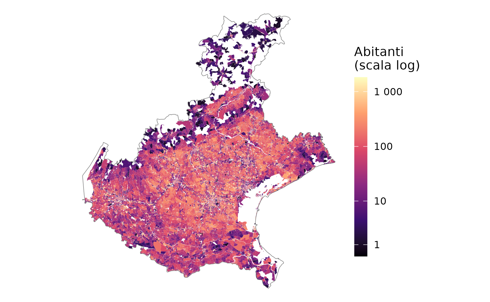

```

- popolazione 30+ ($N$): 3 521 995 ab
- 73% popolazione totale
- densità mediana sezione: 13.5 ab/ha
:::

::: {.column width="33%"}

## Casi attesi $(E_i = N_i \cdot B_i)$

<br>

```{r}
#| echo: false
#| fig-align: "center"
#| out-width: "100%"


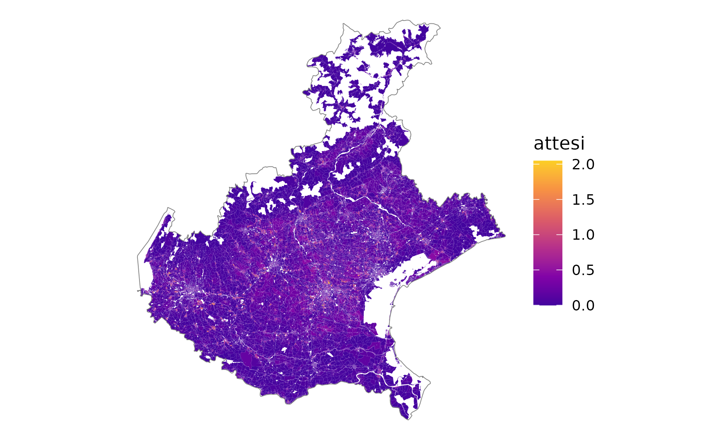

```

- tasso grezzo mortalità provinciale ($B$)
- malattie sistema respiratorio (ICD-10:J00-J99)
- tasso medio regionale: 0.107% (0.084% - 0.140%), 107 casi ogni 100 000 ab
- casi attesi: modello demografico RV
:::

::: {.column width="33%"}

## Frazione Attribuibile $(AF_i)$

<br>

```{r}
#| echo: false
#| fig-align: "center"
#| out-width: "100%"


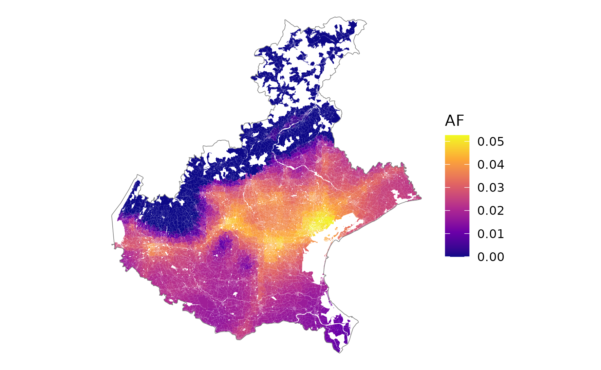

```

- quota di mortalità potenzialmente evitabile attraverso l’azzeramento del differenziale di esposizione controfattuale

- $(RR−1)/RR$ esprime la proporzione dei casi attesi associata al differenziale considerato

::::::

<br>

::: testo-centrato

[**Le mappe rappresentano gli 'strati' (*layers*) che determinano la stima della distribuzione territoriale dei casi evitabili.**]{.highlight}

:::

---

# AC casi attribuibili (evitabili)

<br>
<br>

## Stima puntuale 2025 

<br>

:::::: columns

:::: {.column width="50%"}

## Per Provincia

<br>

::: {.tabella-highlight .riga-2 .riga-5}

| Provincia | Attesi |    AC |     AF | $AC_{low}$ | $AC_{upp}$ |
|:----------|-------:|------:|-------:|-----------:|-----------:|
| Belluno   |    209 |  0.21 | 0.0010 |       0.13 |       0.29 |
| Padova    |    766 | 27.10 | 0.0354 |      16.50 |      37.30 |
| Rovigo    |    148 |  2.84 | 0.0192 |       1.73 |       3.92 |
| Treviso   |    587 | 17.40 | 0.0297 |      10.60 |      24.00 |
| Venezia   |    626 | 23.90 | 0.0381 |      14.60 |      32.80 |
| Verona    |    797 | 19.50 | 0.0245 |      11.90 |      26.90 |
| Vicenza   |    668 | 17.70 | 0.0265 |      10.80 |      24.40 |

:::

::::

:::: {.column .left-align width="50%"}

## Per Regione

<br>

### Stima con valore centrale (RR = 1.05)

[$AC$ = 109.0 casi/anno ($AF$ = 2.86%)]{.highlight}

<br>
<br>

### Stima con incertezza RR (1.03 - 1.07)

[$AC_{low}$ = 66.3 casi/anno ($AF_{low}$ = 1.74%)]{.highlight}

[$AC_{upp}$ = 150.0 casi/anno ($AF_{upp}$ = 3.95%)]{.highlight}

::::

::::::

<br>
<br>

::: testo-centrato
[**Casi attribuibili (evitabili):<br> quota dei decessi attesi associata all’esposizione ambientale eccedente il livello controfattuale OMS,<br>sono interpretabili come casi *evitabili* se il differenziale viene annullato.**]{.highlight}
:::

---

# Simulazione 2025

:::: columns
::: {.column width="73%"}
```{r}
#| echo: false
#| fig-align: "center"
#| out-width: "70%"

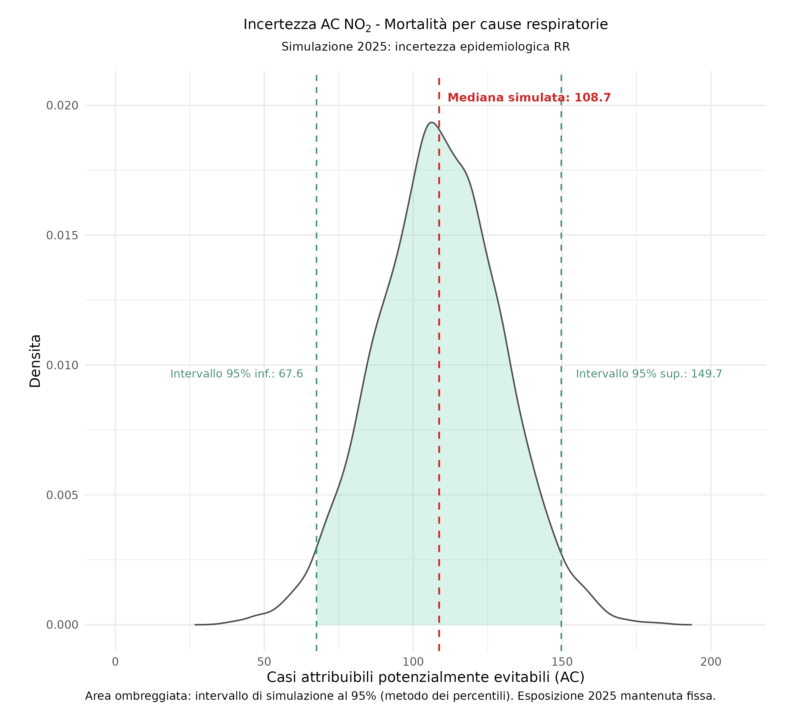
```
:::

::: {.column .left-align width="27%"}
<br>

## Che cosa varia?

- estrazione valore di $RR_{10}$ da una distribuzione log-normale.

## Rimangono fissi

- concentrazioni modellate 2025

- popolazione per sezione

- tassi grezzi provinciali

## Risultato

- **mediana:** 108.7 casi/anno

- **IC 95%:** 67.6–149.7 casi/anno

- **stima deterministica:** 109 casi/anno

<br>

[IC 95% propaga incertezza $RR$]{.highlight}

<br>

Non è una validazione indipendente ma una descrizione della distribuzione probabilistica di impatto

:::
::::

---

# Simulazione storica 2019-2025

:::: columns

::: {.column width="73%"}
```{r}
#| echo: false
#| fig-align: "center"
#| out-width: "75%"

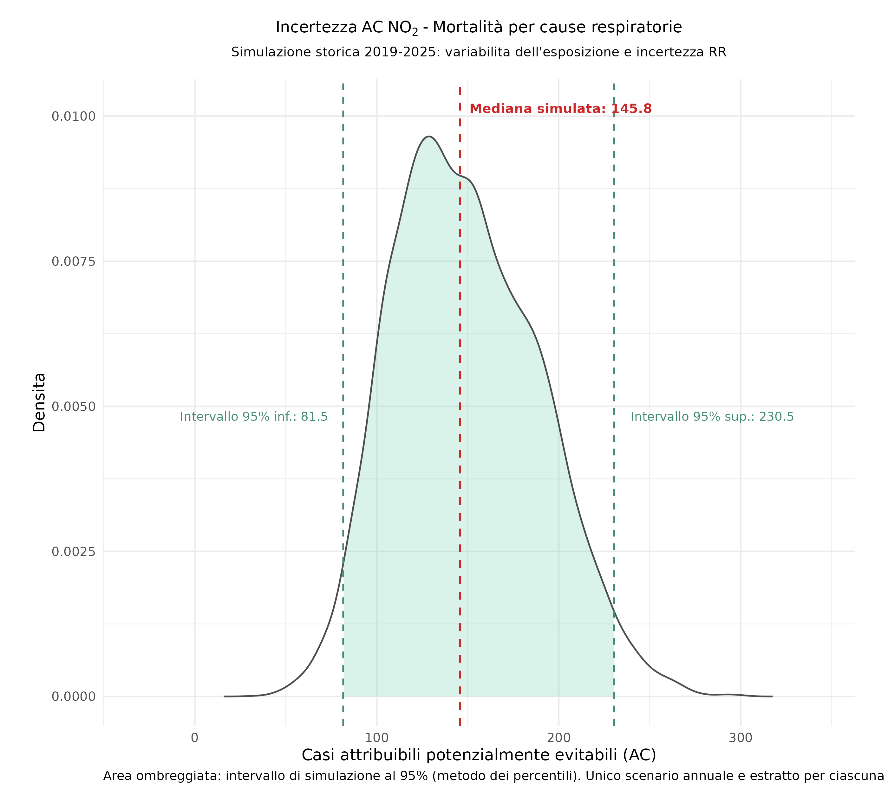
```
:::

::: {.column .left-align width="27%"}

<br>

## Che cosa varia?

- estratto un anno di simulazione 2019-2025 (uniforme)
- estratto un valore $RR$ (lognorm)

## Rimangono fissi

- campo spaziale per sezioni
- popolazione sezionale
- tassi grezzi provinciali

## Risultato

- mediana: 145.8 casi/anno
- intervallo 95%: 81.5 – 230.5
- stima centrale +34% rispetto 2025, scenario esposizione "favorevole"


[Descrive la sensibilità dei risultati agli scenari storici ambientali impiegati
(anno esposizione)]{.highlight}

<br>

Non è un IC della stima 2025

:::

::::

---

# Scomposizione simulazione storica 2019-2025

:::: columns

::: {.column width="50%"}

```{r}
#| echo: false
#| fig-align: "center"
#| out-width: "100%"

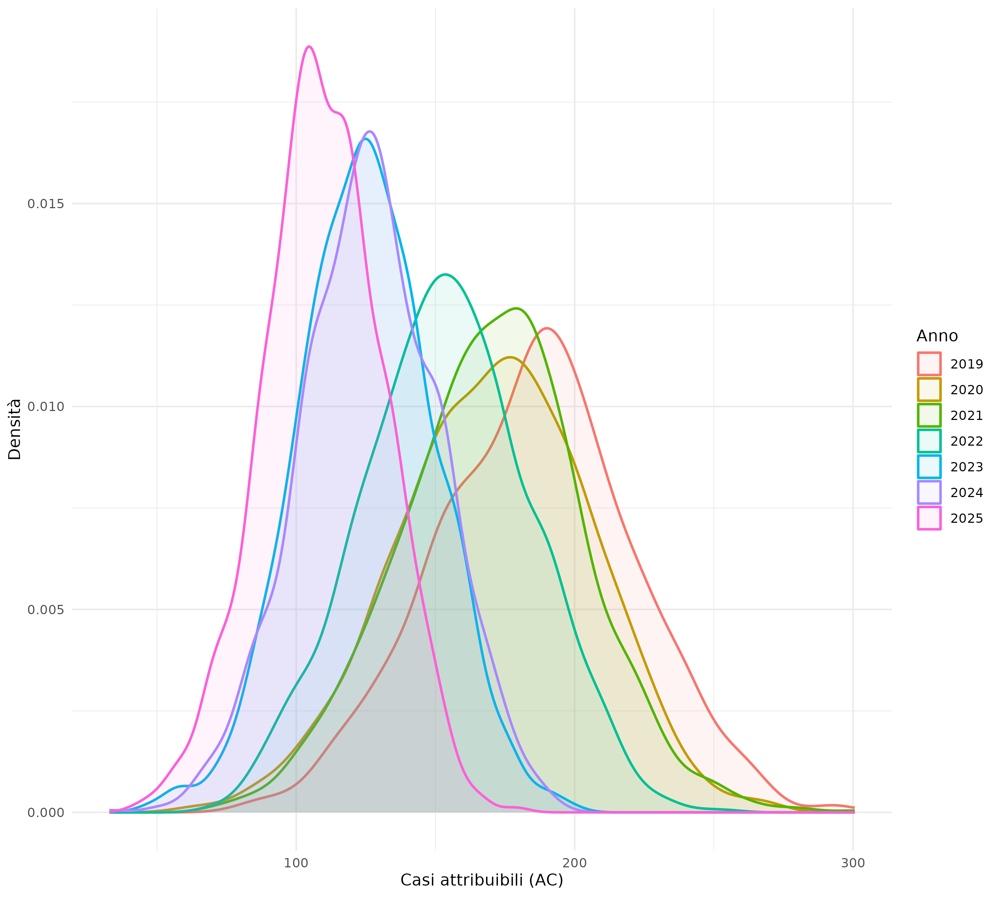

```

:::

::: {.column width="50%"}

```{r}
#| echo: false
#| fig-align: "center"
#| out-width: "100%"

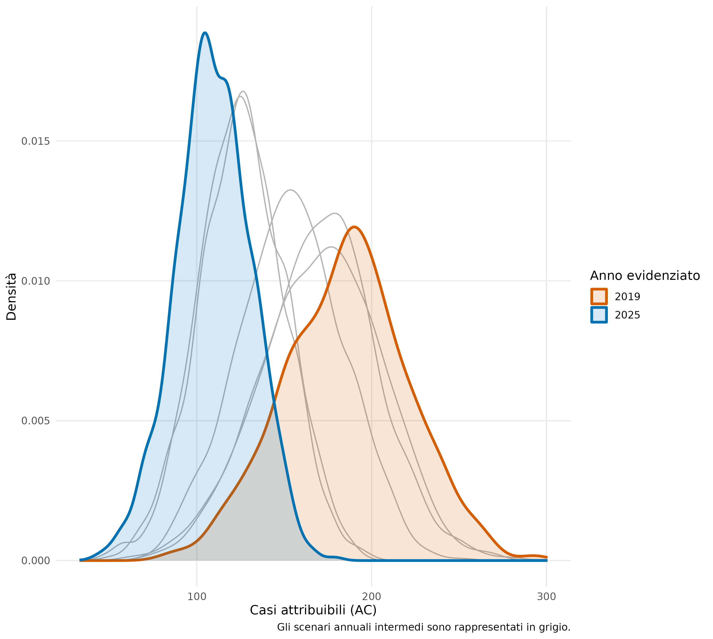

```

:::

::::

<br>

::: testo-centrato
[Per la simulazione storica complessiva l'ampiezza della distribuzione deriva da incertezza RR ma anche da distribuzioni annuali su differenti livelli di inquinamento atmosferico.<br>Lo spostamento verso valori più bassi dal 2019 al 2025 descrive la variazione del carico attribuibile che si otterrebbe applicando i vari scenari alla stessa popolazione di riferimento.]{.highlight style="--highlight-size: 0.75em;"}
:::

---

# Conclusioni

:::::: columns
::: {.column .left-align width="33%"}
<br>

## Impatto sanitario

<br>

Scenario 2025

- stima puntuale popolazione 30+

- 109 decessi respiratori attribuibili/anno 

- $AF=2{.}86\%$

Simulazione 2025 

- quantifica incertezza epidemiologica RR
- IC 95%: 68–150 casi/anno

:::

::: {.column .left-align width="33%"}
<br>

## Distribuzione spaziale

<br>

Il carico stimato è maggiore con:

- popolazione più numerosa
- concentrazioni più elevate
- maggiore differenziale da controfattuale OMS

Padova e Venezia con i valori assoluti più elevati, Belluno più bassi
:::

::: {.column .left-align width="33%"}
<br>

## Intervallo temporale

<br>

Stima casi/anno potenzialmente evitabili:

- Scenario 2025 relativamente "favorevole" del periodo 2019–2025

- La simulazione storica non sostituisce la stima specifica del 2025 ma la colloca nel contesto della variabilità ambientale osservata.
:::
::::::

<br>

::: row-highlight
**Sintesi**

- Esposizione $\mathrm{NO}_2$ eccedente il valore controfattuale OMS è associata ad un carico non trascurabile di mortalità respiratoria nella popolazione.

- I risultati quantificano un impatto potenziale sulla popolazione 30+ (casi evitabili/anno) ma:

  - *non* si tratta di decessi individualmente identificabili (stime
  ecologiche di gruppo)

  - *non* è una dimostrazione di causalità locale (nesting $RR$ da letteratura OMS)
:::

---


# Possibili sviluppi futuri

<br>

::: row-highlight
**Obiettivo operativo:** 

rafforzare la VIS come strumento quantitativo di supporto alle politiche regionali di prevenzione ambientale e sanitaria

:::

<br>

**Mortalità basale**

  - utilizzo di tassi età-specifici e popolazioni sezionali aggiornate
  
**Propagazione integrata dell'incertezza di stima**

  - RR, concentrazioni, tassi basali e demografia
  
**Stime ambientali**

  - downscaling modellistica 1 km e ripartizione errore con struttura spaziale

**Inferenza causale spaziale**

  - trattamento confondenti socio-demografici: *generalised ecological propensity score*, *IPTW*
  
**Modelli spaziali e spazio-temporali**

  - stabilizzazione mortalità per piccole aree mediante Empirical Bayes
  - modelli gerarchici bayesiani per la dipendenza spaziale (inferenza INLA), modellazione esplicita trend ed autocorrelazione temporale

---

# Grazie per l'attenzione {.section-slide data-visibility="uncounted"}

## massimo.bressan@arpa.veneto.it

---
