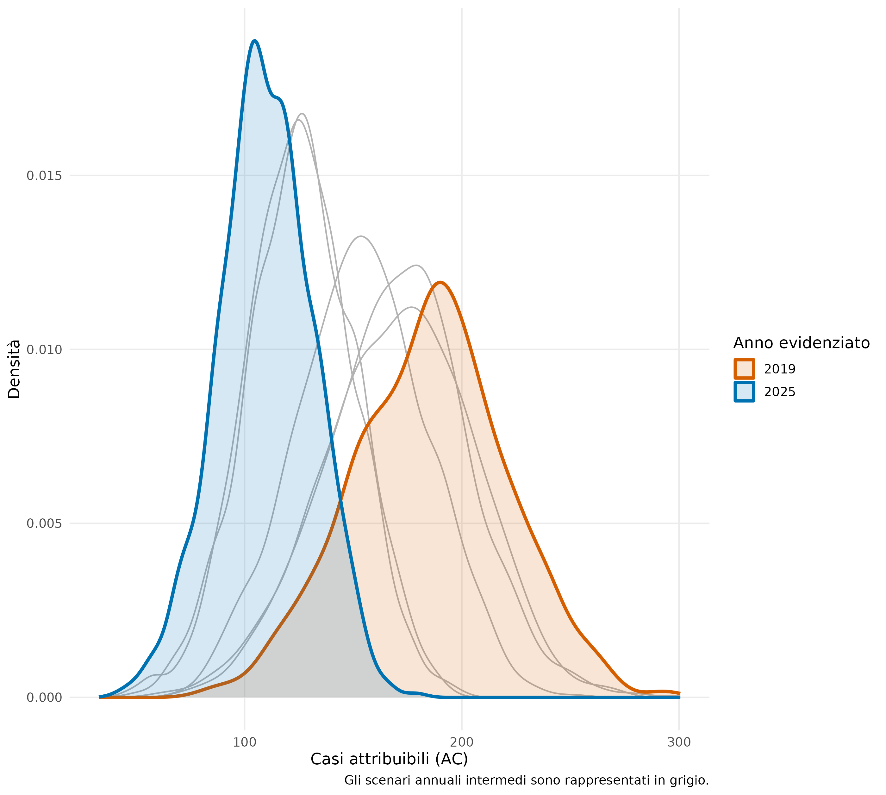

# Domanda VIS \| disegno \| fonti

<br>

::: testo-centrato
[**Quanti decessi per cause respiratorie sono potenzialmente evitabili
se**<br> l'esposizione annuale a $NO_2$ atmosferico viene ricondotta al
livello guida OMS?]{.highlight .big}
:::

<br>

:::::: columns
::: {.column width="55%"}
<br>

```{r}
#| echo: false
#| fig-align: "center"
#| out-width: "120%"


knitr::include_graphics("./fig_tab/map_sezioni_censuarie_rv.png")

```
:::

:::: {.column .left-align width="45%"}
<br>

::: {.tabella-grande style="--table-font-size: 22px; --table-line-height: 1.5; --table-padding: 8px;"}
| Componente           | Dato utilizzato                                  |
|:---------------------|:-------------------------------------------------|
| Disegno studio       | Ecologico su base territoriale                   |
| Unità demografica    | 43 447 sezioni censuarie (ISTAT 2021)            |
| Popolazione target   | 3 521 995 residenti 30+ (ISTAT 2021)             |
| Esposizione          | $NO_2$ modellato griglia 4 km (ARPAV)            |
| Mortalità basale     | Tassi grezzi provinciali 30+ (ISTAT 2024)        |
| Esito sanitario      | Mortalità malattie respiratorie (ICD-10 J00–J99) |
| Funzione rischio     | $RR_{10}=1{.}05$ - IC 95%: 1.03 – 1.07 (OMS)     |
| Serie storica $NO_2$ | 2019–2025 (ARPAV)                                |
:::
::::
::::::

<br>

---

# Qualità aria ambiente {.columns-max}

::::: columns
::: {.column width="50%"}

## $NO_2$ modellistica 2019-2025

<br>

```{r}
#| echo: false
#| fig-align: "center"
#| out-width: "75%"


knitr::include_graphics("./fig_tab/map_no2_ts_rv.png")

```
:::

::: {.column width="50%"}

## $NO_2$ boxplot per Provincia 2019-2025

<br>

```{r}
#| echo: false
#| fig-align: "center"
#| out-width: "75%"

knitr::include_graphics("./fig_tab/no2_boxplot_no2_provincia.png")

```
:::
:::::

::: testo-centrato
[Il valore OMS controfattuale non è una soglia biologica al di sotto
della quale il rischio è necessariamente nullo]{.highlight}
:::

---

# Concentrazioni ambientali per sezione {.columns-max}

::::: columns
::: {.column width="50%"}
## $NO_2$ anno 2025

```{r}
#| echo: false
#| fig-align: "center"
#| out-width: "80%"

knitr::include_graphics("./fig_tab/map_sezioni_no2_2025.png")

```

media pesata  $NO_2$ sulla superficie
:::

::: {.column width="50%"}
## delta $NO_2$ : \[2025\] - \[target OMS\]

```{r}
#| echo: false
#| fig-align: "center"
#| out-width: "80%"

knitr::include_graphics("./fig_tab/map_sezioni_delta_no2_2025_target_oms.png")

```

delta controfattuale $NO_2$

:::
:::::

Media annuale $NO_2$: overlay disegno sezioni censuarie e grigliato
  output modello dispersione atmosferica CAMx con risoluzione
  orizzontale 4 km.

Delta esposizione $NO_2$: media 5.7 $\mu g~m^{-3}$, mediana 5.9
  $\mu g~m^{-3}$, range interquartile 3.9 $\mu g~m^{-3}$.

<br>

::: testo-centrato
[**Concentrazione ambientale vs. controfattuale OMS per sezione
censuaria**]{.highlight}
:::

---

# Esposizione popolazione {.columns-max}

::::: columns
::: {.column width="50%"}

## Per Regione

```{r}
#| echo: false
#| fig-align: "center"
#| out-width: "65%"

knitr::include_graphics("./fig_tab/no2_exp_pop_2019_2025.png")

```

media pesata per Regione: 16 $\mu g~m^{-3}$

:::

::: {.column width="50%"}

## Per Provincia

```{r}
#| echo: false
#| fig-align: "center"
#| out-width: "65%"

knitr::include_graphics("./fig_tab/no2_exp_pop_2019_2025_by_province.png")

```

media pesata per Provincia: BL = 7 $\mu g~m^{-3}$, PD e VE = 18
  $\mu g~m^{-3}$
:::
:::::

---

# Dal controfattuale per sezione alla stima regionale

::: {.formula style="--formula-size: 36px;"}
[$\Delta C_i \longrightarrow AF_i \longrightarrow AC_i$]{.highlight}
:::

## Per sezione censuaria $i$:

$$C_{i,\mathrm{cf}}=\min(C_{i,2025},10),
\qquad
\Delta C_i=\max(C_{i,2025}-10, 0)$$

<br>

:::::: columns
::: {.column width="30%"}

## Decessi attesi

$$E_i=N_{i,30+}\cdot B_{p(i),30+}$$

$N_{i,30+}$: popolazione della sezione

$B_{p(i),30+}$: tasso grezzo provinciale
:::

::: {.column width="30%"}

## Frazione attribuibile

$$AF_i = \frac{RR_i-1}{RR_i} = 1-e^{-\beta\Delta C_i}$$

$$RR_i = e^{\beta\Delta C_i} \qquad \beta=\frac{\log(RR_{10})}{10}$$
$AF_i$: quota casi attribuibili all’esposizione
:::

::: {.column width="30%"}
## Casi evitabili

$$AC_i=E_i\cdot AF_i$$
stima di impatto controfattuale
:::
::::::

<br>

## Per Regione:

$$AC_{\mathrm{Regione}}=\sum_i AC_i$$

Nelle sezioni censuarie con $C_i \leq 10$ viene definito
$\Delta C_i = 0$ per non attribuire un *artificiale effetto protettivo*.

---

# Popolazione \| Attesi \| AF per sezione {.columns-max}

::: {.column width="33%"}

## Popolazione 30+ $(N_i)$

<br>

```{r}
#| echo: false
#| fig-align: "center"
#| out-width: "100%"


knitr::include_graphics("./fig_tab/map_sez_pop30p.png")

```

- popolazione 30+ ($N$): 3 521 995 ab (73% popolazione totale)
- densità mediana sezione: 13.5 ab/ha
:::

::: {.column width="33%"}

## Casi attesi $(E_i = N_i \cdot B_i)$

<br>

```{r}
#| echo: false
#| fig-align: "center"
#| out-width: "100%"


knitr::include_graphics("./fig_tab/map_sezioni_attesi.png")

```

- tasso grezzo mortalità provinciale ($B$)
- malattie sistema respiratorio (ICD-10:J00-J99)
- tasso medio regionale: 0.107% (0.084% - 0.140%), 107 casi ogni 100 000 ab
:::

::: {.column width="33%"}

## Frazione Attribuibile $(AF_i)$

<br>

```{r}
#| echo: false
#| fig-align: "center"
#| out-width: "100%"


knitr::include_graphics("./fig_tab/map_AF_sezioni_no2_2025.png")

```

$$AF_i = \frac{RR_i-1}{RR_i} = 1-e^{-\beta\Delta C_i}$$

::::::

<br>

[**Casi attesi: mappatura demografico-attuariale della Regione Veneto**]{.highlight}

[**Frazione attribuibile: quota di mortalità potenzialmente evitabile attraverso l’azzeramento del differenziale di esposizione controfattuale; $(RR−1)/RR$ esprime la proporzione dei casi attesi associata al differenziale considerato.**]{.highlight}


---

# AC casi attribuibili (evitabili)

$$AC_i=E_i\cdot AF_i \qquad AC_{\mathrm{Provincia}}=\sum_i AC_i \qquad AC_{\mathrm{Regione}}=\sum_i AC_i$$


## Stima puntuale 2025 

<br>

:::::: columns

:::: {.column width="50%"}

## Per Provincia

<br>

::: {.tabella-highlight .riga-2 .riga-5}

| Provincia | Attesi |    AC |     AF | $AC_{low}$ | $AC_{upp}$ |
|:----------|-------:|------:|-------:|-----------:|-----------:|
| Belluno   |    209 |  0.21 | 0.0010 |       0.13 |       0.29 |
| Padova    |    766 | 27.10 | 0.0354 |      16.50 |      37.30 |
| Rovigo    |    148 |  2.84 | 0.0192 |       1.73 |       3.92 |
| Treviso   |    587 | 17.40 | 0.0297 |      10.60 |      24.00 |
| Venezia   |    626 | 23.90 | 0.0381 |      14.60 |      32.80 |
| Verona    |    797 | 19.50 | 0.0245 |      11.90 |      26.90 |
| Vicenza   |    668 | 17.70 | 0.0265 |      10.80 |      24.40 |

:::

::::

:::: {.column .left-align width="50%"}

## Per Regione

<br>

### Stima con valore centrale (RR = 1.05)

[$AC$ = 109.0 casi/anno ($AF$ = 2.86%)]{.highlight}

<br>
<br>

### Stima con incertezza RR (1.03 - 1.07)

[$AC_{low}$ = 66.3 casi/anno ($AF_{low}$ = 1.74%)]{.highlight}

[$AC_{upp}$ = 150.0 casi/anno ($AF_{upp}$ = 3.95%)]{.highlight}

::::

::::::

<br>
<br>

[**Casi attribuibili (evitabili): quota dei decessi attesi associata all’esposizione ambientale eccedente il livello controfattuale<br>sono interpretabili come casi *evitabili* se il differenziale viene annullato**]{.highlight}

---

# Simulazione 2025

::::: columns
::: {.column width="75%"}
```{r}
#| echo: false
#| fig-align: "center"
#| out-width: "70%"

knitr::include_graphics("./fig_tab/ac_sim_2025.png")
```
:::

::: {.column .left-align width="25%"}
<br>

## Che cosa varia?

- estrazione valore di $RR_{10}$ da una distribuzione log-normale.

## Rimangono fissi

- concentrazioni modellate 2025

- popolazione sezionale

- tassi grezzi provinciali

## Risultato

- **mediana:** 108,7 casi/anno

- **IC 95%:** 67,6–149,7 casi/anno

- **stima deterministica:** 109 casi/anno

<br>

[IC 95% propaga esclusivamente l'incertezza epidemiologica $RR$]{.highlight}
:::
:::::

---

# Simulazione 2019-2025

:::::: columns
::: {.column width="65%"}
```{r}

#| echo: false
#| fig-align: "center"
#| out-width: "90%"

knitr::include_graphics("./fig_tab/ac_sim_hist.png")

```
:::

:::: {.column .left-align width="35%"}
```{r}

#| echo: false
#| fig-align: "center"
#| out-width: "45%"



```

- estratto un anno 2019 - 2025, campo spaziale applicato a tutte le
  sezioni, estratto un valore $RR$, popolazione e tassi basali fissi


- mediana: **145,8 casi/anno**
- intervallo 95%: 81.5 – 230.5
- stima centrale **+34%** rispetto al 2025

::: testo-centrato
[Descrive la sensibilità dei risultati agli scenari storici impiegati
(anno esposizione)]{.highlight}
:::
::::
::::::

---

# Conclusioni

:::::: columns
::: {.column .left-align width="33%"}
<br>

## Impatto

<br>

109 decessi respiratori attribuibili/anno

$$AF=2{,}86\%$$

popolazione 30+ nello scenario 2025
:::

::: {.column .left-align width="33%"}
<br>

## Territorio

<br>

Il carico stimato è maggiore nelle aree con:

- popolazione più numerosa
- concentrazioni più elevate
- maggiore differenziale dal riferimento OMS

Padova e Venezia con i valori assoluti più elevati, Belluno più bassi
:::

::: {.column .left-align width="33%"}
<br>

## Tempo

<br>

- Stima casi/anno potenzialmente evitabili

- Scenario 2025 relativamente favorevole rispetto a gran parte del
  periodo 2019–2025

- La simulazione storica non sostituisce la stima specifica del 2025.
:::
::::::

<br>

::: row-highlight
L'esposizione a $\mathrm{NO}_2$ eccedente il livello controfattuale di
riferimento è associata ad un carico non trascurabile di mortalità
respiratoria nella popolazione 30+ del Veneto.

I risultati quantificano un impatto potenziale sulla popolazione 30+:

- *non* si tratta di decessi individualmente identificabili (stime
  ecologiche di gruppo)

- *non* è una dimostrazione di causalità locale (nesting $RR$ da
  letteratura OMS)
:::

---

# Disegno studio: punti di forza e limiti

<br> <br>

::::: columns
::: {.column width="48%"}
### Punti di forza

- Analisi demografica alla scala delle sezioni censuarie
- Calcolo sezionale prima dell’aggregazione regionale
- Scenario controfattuale esplicito: $NO_2 = 10\ \mu g\,m^{-3}$
- Separazione tra:
  - incertezza epidemiologica del $RR$
  - variabilità temporale dell’esposizione
- Procedura trasparente e replicabile
:::

::: {.column width="48%"}
### Limiti

- Disegno ecologico: nessuna inferenza individuale
- Possibili confondimento spaziale, MAUP e spillover
- Tassi provinciali grezzi 30+: nessun aggiustamento per età
- Esposizione vincolata al grigliato di 4 km
- Disallineamento temporale: popolazione 2021, mortalità 2024,
  esposizione 2025
- Incertezza propagata solo per il $RR$
- Simulazione storica descrittiva, non prognostica
:::
:::::

<br>

::: row-highlight
L'estensione della propagazione dell'incertezza, l'adozione di modelli
spaziali e spazio-temporali e l'integrazione di metodi di inferenza
causale renderebbero la valutazione più solida e più adatta al supporto
quantitativo delle politiche regionali di prevenzione ambientale e
sanitaria.
:::

---

# Possibili sviluppi futuri

- **Mortalità basale**
  - utilizzo di tassi provinciali età-specifici
  - confronto di sensibilità tra tassi provinciali e regionali
- **Propagazione integrata dell’incertezza**
  - concentrazioni modellate
  - tassi di mortalità
  - stime demografiche
- **Stime ambientali**
  - downscaling modellistica regionale 1 km
  - propagazione dell’errore con struttura spaziale
- **Modelli spaziali e spazio-temporali**
  - Stima stabilizzata della mortalità nelle piccole aree mediante
    Empirical Bayes
  - Modelli gerarchici bayesiani per la dipendenza spaziale, con
    inferenza tramite INLA
  - Modellazione esplicita del trend e dell’autocorrelazione temporale
- **Inferenza causale spaziale**
  - controllo dei confondenti socio-demografici
  - applicazione di *propensity score*, *IPTW*, *g-computation*

::: row-highlight
**Obiettivo operativo:** estendere la VIS da analisi descrittiva a
strumento più robusto di supporto alle politiche regionali.
:::

---

# Fine {.section-slide data-visibility="uncounted"}

---

# BACKUP SLIDES


