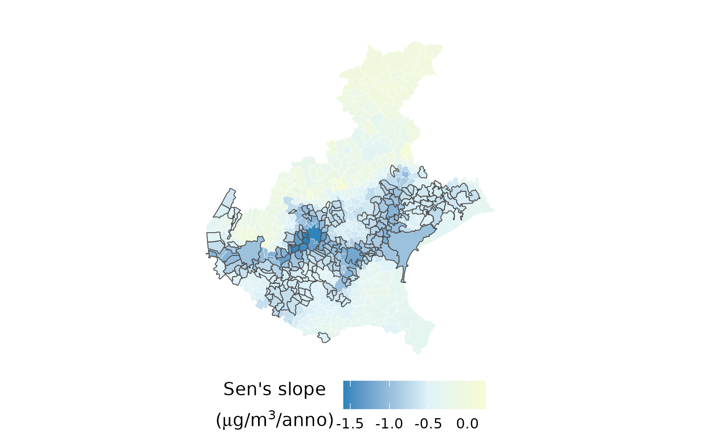

# MY BACKUP SLIDES

---

# Dall'esposizione ai casi attribuibili (evitabili)

<br>
<br>

::: {.formula style="--formula-size: 34px;"}

[$\Delta C_i \longrightarrow AF_i \longrightarrow AC_i$]{.highlight}

:::


<br>
<br>

:::::: {.columns}

::: {.column width="32%"}

## Eccedenza concentrazione (esposizione)

$$
\Delta C_i=\max(C_{i,2025}-10,0)
$$

- solo la concentrazione eccedente il livello guida OMS

:::

::: {.column width="32%"}

## Frazione attribuibile

$$
AF_i=\frac{RR_i-1}{RR_i} =1-e^{-\beta\Delta C_i}
$$

- $\beta=\log(RR_{10})/10$.

:::

::: {.column width="32%"}

## Casi attribuibili (evitabili)

$$
AC_i=
N_{i,30+}\,B_{p(i),30+}\,AF_i
$$

- popolazione 30+
- mortalità basale provinciale
- frazione attribuibile (RR, $\Delta C$)

:::

<br>
<br>

::::::

::: {.formula style="--formula-size: 32px;"}
$$
AC_{\mathrm{Regione}}=\sum_i AC_i
$$
:::

::: {.testo-centrato}
[Il calcolo viene effettuato per sezione di censimento e successivamente aggregato]{.highlight}
:::

---

# Punti di forza e criticità

<br> <br>

::::: columns
::: {.column width="48%"}
## Punti di forza [+]

- Analisi demografica alla scala delle sezioni censuarie
- Calcolo sezionale prima dell’aggregazione regionale
- Scenario controfattuale esplicito: $NO_2 = 10\ \mu g\,m^{-3}$
- Separazione tra:
  - incertezza epidemiologica del $RR$
  - variabilità temporale dell’esposizione
- Procedura trasparente e replicabile
:::

::: {.column width="48%"}
## Criticità [-]

- Disegno ecologico: nessuna inferenza individuale
- Singolo inquinante (problema collinearità altri inquinanti)
- Confondimento e dipendenza spaziale, MAUP
- Tassi provinciali grezzi 30+ senza aggiustamento per età
- Esposizione vincolata al grigliato di 4 km
- Disallineamento temporale: popolazione 2021, mortalità 2024,
  esposizione 2025
- No propagazione complessiva incertezza
- Simulazione storica descrittiva, non prognostica
:::
:::::

::: row-highlight

In prospettiva:

- estensione della propagazione dell'incertezza
- adozione di modelli spazio-temporali
- integrazione di metodi di inferenza causale 

possono rendere la valutazione più robusta ed adatta al supporto quantitativo delle politiche regionali di prevenzione ambientale e sanitaria.
:::

---

# $NO_2$ - Mann-Kendall test and Sen's slope

Media per Comune con aggiustamento per confronti multipli (Benjamini–Hochberg)

```{r}
#| echo: false
#| fig-align: "center"
#| out-width: "75%"



```

---

# Casi evitabili

```{r}
#| message: false
#| warning: true
#| out-width: '100%'

library(ggplot2)

crea_grafico_scenari <- function(
    titolo = "Scenario impatto immediato vs. graduale",
    titolo_x = "Anno",
    titolo_y = "Impatto",
    col_immediato = "#2B5C8F",   # Blu per scenario immediato
    col_graduale = "#D95F02",    # Arancione per scenario graduale
    col_area_ritardo = "#E41A1C",# Rosso per costo del ritardo
    col_area_graduale = "#FDBF6F",# Colore per l'area sotto lo scenario graduale
    alpha_aree = 0.25,           # Trasparenza delle aree
    filename_png = NULL,
    width = 10,
    height = 6,
    dpi = 300
) {
  
  # 1. Costruzione dei dati basati sull'infografica (2025-2030)
  df <- data.frame(
    Anno = 2025:2030,
    Scenario_Immediato = rep(100, 6),
    Scenario_Graduale  = c(0, 20, 40, 60, 80, 100)
  )
  
  # 2. Costruzione del grafico
  p <- ggplot(df, aes(x = Anno)) +
    
    # Area sotto lo Scenario Graduale (da 0 a Scenario Graduale)
    geom_ribbon(
      aes(ymin = 0, ymax = Scenario_Graduale, fill = "Casi evitati"), 
      alpha = alpha_aree
    ) +
    
    # Area per il "Costo del Ritardo" (da Scenario Graduale a Scenario Immediato)
    geom_ribbon(
      aes(ymin = Scenario_Graduale, ymax = Scenario_Immediato, fill = "'Costo' del ritardo"), 
      alpha = alpha_aree
    ) +
    
    # Linee e punti per i due scenari
    geom_line(aes(y = Scenario_Immediato, color = "immediato"), linewidth = 1.2) +
    geom_point(aes(y = Scenario_Immediato, color = "immediato"), size = 3) +
    
    geom_line(aes(y = Scenario_Graduale, color = "graduale"), linewidth = 1.2) +
    geom_point(aes(y = Scenario_Graduale, color = "graduale"), size = 3) +
    
    # Etichette dinamiche sui punti iniziali
    annotate("text", x = 2025, y = 5, label = "0%", color = col_graduale, fontface = "bold", vjust = -0.5) +
    annotate("text", x = 2025, y = 97, label = "100%", color = col_immediato, fontface = "bold", vjust = 1.5) +
    
    # Scale personalizzate per linee e riempimenti
    scale_color_manual(
      name = "Scenari impatto:",
      values = c(
        "immediato" = col_immediato, 
        "graduale"  = col_graduale
      )
    ) +
    scale_fill_manual(
      name = "Area impatto:",
      values = c(
        "'Costo' del ritardo"  = col_area_ritardo,
        "Casi evitati"  = col_area_graduale
      )
    ) +
    
    # Configurazione della legenda su 2 righe (Impilamento verticale dei blocchi)
    guides(
      color = guide_legend(nrow = 1, order = 1),
      fill  = guide_legend(nrow = 1, order = 2)
    ) +
    
    # Formattazione assi
    scale_x_continuous(breaks = 2025:2030) +
    scale_y_continuous(
      limits = c(0, 100), 
      breaks = seq(0, 100, 20),
      labels = function(x) paste0(x, "%")
    ) +
    
    # Titoli
    labs(
      title = titolo,
      subtitle = "Intervallo temporale: 6 anni (2025 - 2030)",
      x = titolo_x,
      y = titolo_y
    ) +
    
    # Tema grafico
    theme_minimal(base_size = 14) +
    theme(
      plot.title = element_text(face = "bold", size = 16, hjust = 0),
      plot.subtitle = element_text(color = "gray30", size = 12),
      axis.title = element_text(face = "bold"),
      legend.position = "bottom",
      legend.box = "vertical",          # Dispone le due legende (Scenari ed Aree) una sopra l'altra
      legend.box.just = "left",        # Allinea a sinistra la legenda
      legend.title = element_text(face = "bold", size = 11),
      legend.spacing.y = unit(0.02, "cm"),  # Reduces vertical gap between legend boxes
      legend.box.spacing = unit(0.5, "cm"), # Reduces gap between the plot area and the legend
      panel.grid.minor = element_blank()
    )
  
  # 3. Esportazione PNG opzionale
  if (!is.null(filename_png)) {
    ggsave(
      filename = filename_png, 
      plot = p, 
      width = width, 
      height = height, 
      dpi = dpi,
      device = "png"
    )
    message("Grafico esportato con successo in: ", filename_png)
  }
  
  return(p)
}

crea_grafico_scenari(titolo_x = NULL)


```

---

# Casi evitabili (Jensen)

```{r}
#| message: false
#| warning: true
#| out-width: '100%'

crea_grafico_scenari_jensen <- function(
    titolo = "Scenario impatto immediato vs. graduale",
    titolo_x = "Anno",
    titolo_y = "Impatto",
    col_immediato = "#2B5C8F",   # Blu per scenario immediato
    col_graduale = "#D95F02",    # Arancione per scenario graduale
    col_jensen = "#7570B3",      # Viola per effetto non lineare (Jensen)
    col_area_ritardo = "#E41A1C",# Rosso per costo del ritardo
    col_area_graduale = "#FDBF6F",# Colore per l'area sotto lo scenario graduale
    alpha_aree = 0.25,           # Trasparenza delle aree
    k_concavita = 1.000,             # Parametro di curvatura (k > 0 rende la curva concava)
    filename_png = NULL,
    width = 10,
    height = 6,
    dpi = 300
) {
  
  # 1. Costruzione dei dati con traiettoria concava esponenziale: 1 - exp(-k*t)
  t_norm <- (2025:2030 - 2025) / 5  # Tempo normalizzato da 0 a 1
  
  df <- data.frame(
    Anno = 2025:2030,
    Scenario_Immediato = rep(100, 6),
    Scenario_Graduale  = c(0, 20, 40, 60, 80, 100),
    # Curva concava (impatto rapido all'inizio, poi saturazione)
    Scenario_Jensen    = 100 * (1 - exp(-k_concavita * t_norm)) / (1 - exp(-k_concavita))
  )
  
  # 2. Costruzione del grafico
  p <- ggplot(df, aes(x = Anno)) +
    
    # Area sotto lo Scenario Graduale (da 0 a Scenario Graduale)
    geom_ribbon(
      aes(ymin = 0, ymax = Scenario_Graduale, fill = "Casi evitati"), 
      alpha = alpha_aree
    ) +
    
    # Area per il "Costo del Ritardo" (da Scenario Graduale a Scenario Immediato)
    geom_ribbon(
      aes(ymin = Scenario_Graduale, ymax = Scenario_Immediato, fill = "'Costo' del ritardo"), 
      alpha = alpha_aree
    ) +
    
    # Linee e punti per gli scenari
    geom_line(aes(y = Scenario_Immediato, color = "immediato"), linewidth = 1.2) +
    geom_point(aes(y = Scenario_Immediato, color = "immediato"), size = 3) +
    
    geom_line(aes(y = Scenario_Graduale, color = "graduale"), linewidth = 1.2) +
    geom_point(aes(y = Scenario_Graduale, color = "graduale"), size = 3) +
    
    # Linea concava esponenziale per la disuguaglianza di Jensen
    geom_line(aes(y = Scenario_Jensen, color = "non lineare (Jensen's inequality)"), linewidth = 1.2, linetype = "dashed") +
    geom_point(aes(y = Scenario_Jensen, color = "non lineare (Jensen's inequality)"), size = 3) +
    
    # Etichette dinamiche sui punti iniziali
    annotate("text", x = 2025, y = 5, label = "0%", color = col_graduale, fontface = "bold", vjust = -0.5) +
    annotate("text", x = 2025, y = 97, label = "100%", color = col_immediato, fontface = "bold", vjust = 1.5) +
    
    # Scale personalizzate per linee e riempimenti
    scale_color_manual(
      name = "Scenari impatto:",
      values = c(
        "immediato"            = col_immediato, 
        "graduale"             = col_graduale,
        "non lineare (Jensen's inequality)" = col_jensen
      )
    ) +
    scale_fill_manual(
      name = "Area impatto:",
      values = c(
        "'Costo' del ritardo" = col_area_ritardo,
        "Casi evitati"       = col_area_graduale
      )
    ) +
    
    # Configurazione della legenda su 2 righe
    guides(
      color = guide_legend(nrow = 1, order = 1),
      fill  = guide_legend(nrow = 1, order = 2)
    ) +
    
    # Formattazione assi
    scale_x_continuous(breaks = 2025:2030) +
    scale_y_continuous(
      limits = c(0, 100), 
      breaks = seq(0, 100, 20),
      labels = function(x) paste0(round(x), "%")
    ) +
    
    # Titoli
    labs(
      title = titolo,
      subtitle = "Intervallo temporale: 6 anni (2025 - 2030)",
      x = titolo_x,
      y = titolo_y
    ) +
    
    # Tema grafico
    theme_minimal(base_size = 14) +
    theme(
      plot.title = element_text(face = "bold", size = 16, hjust = 0),
      plot.subtitle = element_text(color = "gray30", size = 12),
      axis.title = element_text(face = "bold"),
      legend.position = "bottom",
      legend.box = "vertical",
      legend.box.just = "left",
      legend.title = element_text(face = "bold", size = 11),
      legend.spacing.y = unit(0.02, "cm"),
      legend.box.spacing = unit(0.5, "cm"),
      panel.grid.minor = element_blank()
    )
  
  # 3. Esportazione PNG opzionale
  if (!is.null(filename_png)) {
    ggsave(
      filename = filename_png, 
      plot = p, 
      width = width, 
      height = height, 
      dpi = dpi,
      device = "png"
    )
    message("Grafico esportato con successo in: ", filename_png)
  }
  
  return(p)
}

crea_grafico_scenari_jensen()

```

